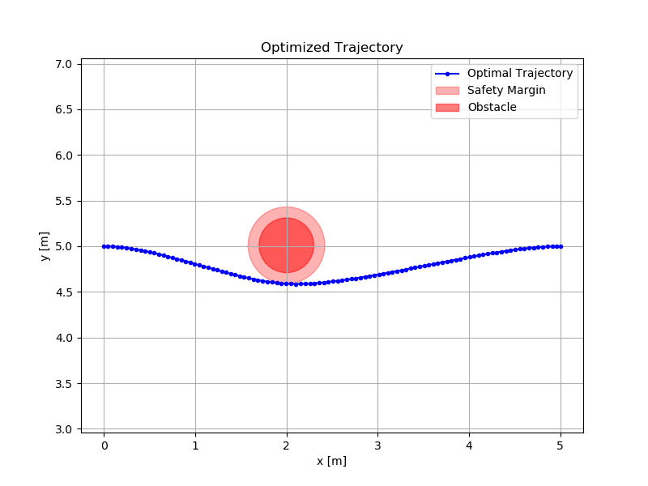
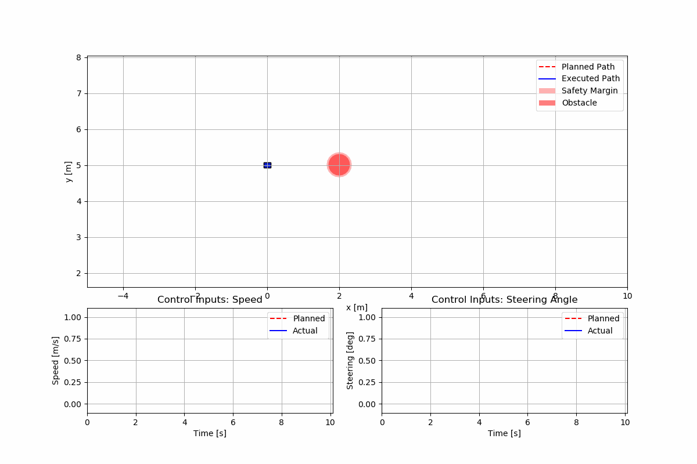

# ECSE 683

This repo contains the coursework for ECSE 683 at McGill University.

## Assignment 1: Optimal Control

### Simulator

#### Gazebo
**Task:** Overtaking static obstacle.

For simulation environment setup, refer to [Simulator Setup Guide](https://github.com/simonli357/Simulator).

### Problem Setup

#### Task
Overtake a static vehicle on a straight line while staying within speed limits and avoiding collisions.

#### State Variables
- Car position (x, y), yaw angle θ
- Obstacle positions

#### Control Inputs
- Velocity v
- Steering angle δ

### Optimal Control Formulation

#### Cost Function
Minimize over horizon T:
```
J = Σ [w₁(v - v_desired)² + w₂(y - y_lane_center)² + w₃v² + w₄δ²] + Terminal Cost
```
**Terms:** Speed tracking, lane centering, control effort.  
**Terminal Cost:** Penalize deviation from final target position/speed.

#### Constraints

#### Vehicle Dynamics (bicycle model)
```
ẋ = v cos(θ)  
ẏ = v sin(θ)  
θ̇ = (v / L) tan(δ)  
```

#### Physical Limits
- Velocity: v ∈ [v_min, v_max]
- Steering angle: δ ∈ [δ_min, δ_max]

#### Collision Avoidance
Enforce distance_to_obstacle(t) > safety_margin for all t.

### Implementation Steps

#### Model & Simulator Setup
- Choose Gazebo. For simplicity, start with a kinematic bicycle model in Python (no simulator).
- Define state/control variables and dynamics.

#### Trajectory Optimization (Direct Collocation)
- Use CasADi (Python) for symbolic differentiation and solver setup.
- Discretize the trajectory into N steps and solve with IPOPT.

#### Discretization Strategy

- The time horizon **T** is divided into **N** time steps:  
  \[t_0, t_1, \dots,t_N\]
- The **state trajectory** is represented as:  
  \[
  X = [x_0, x_1, \dots, x_N]
  \]
- The **control trajectory** is represented as:  
  \[
  U = [u_0, u_1, \dots, u_{N-1}]
  \]
- Control inputs \( u_i \) are assumed **constant** within each interval \( [t_i, t_{i+1}] \).

#### Inequality Constraints
- **Physical Limits:** Enforce bounds on velocity and steering angle.
- **Collision Avoidance:** Ensure vehicle does not overlap with static/dynamic obstacles.

#### Implementation with CasADi (Python)
- Use CasADi for automatic differentiation and symbolic computation.
- Define dynamics as symbolic equations.
- Solve using IPOPT, an interior-point NLP solver.

#### iLQR
- Implement iLQR with a quadratic approximation of the cost and linearized dynamics.
- Use automatic differentiation for dynamics Jacobians.

#### Integration with Simulator
- In Gazebo: Use ROS Noetic and the provided simulator instructions to spawn the ego vehicle, apply optimized controls, and track obstacles.
- Add noise to the dynamics model to test robustness.

### Results

#### Optimized Trajectory (Static Visualization)


#### Combined Trajectory (Animated)


#### Overtaking Maneuver (Gazebo Simulation)
[View Demo Video](a1/assets/a1demo.mp4)

### Example Tools/Code
- **Optimization:** CasADi (for direct collocation).
- **Baseline Code:** Modify this trajectory optimization example: [CasADi Direct Collocation Example](https://github.com/casadi/casadi/blob/main/docs/examples/python/direct_collocation.py)

### How to Use

#### Without Simulation (Only Plotting)
1. Install dependencies:
   ```bash
   pip install -r requirements.txt
   ```
2. Run the control algorithm:
   ```bash
   python3 a1/control_test.py
   ```

#### With Gazebo Simulation
1. Install ROS Noetic.
2. Follow the [Simulator Setup Guide](https://github.com/simonli357/Simulator) for environment configuration.
3. Launch Gazebo following instructions in the link.
4. Run the control node:
   ```bash
   python3 a1/control_gazebo.py
   ```

